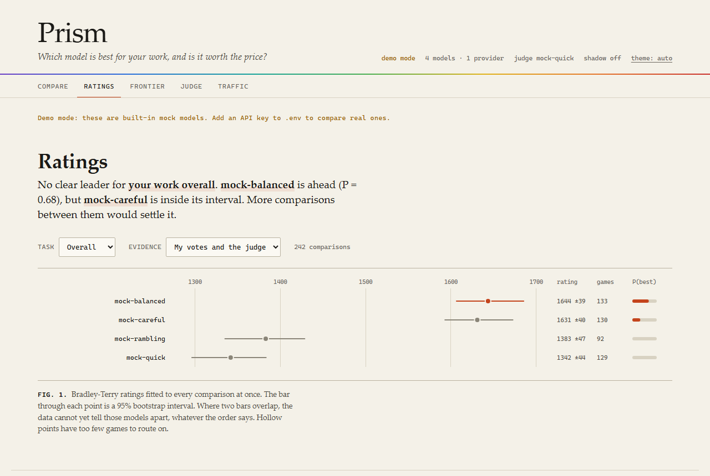
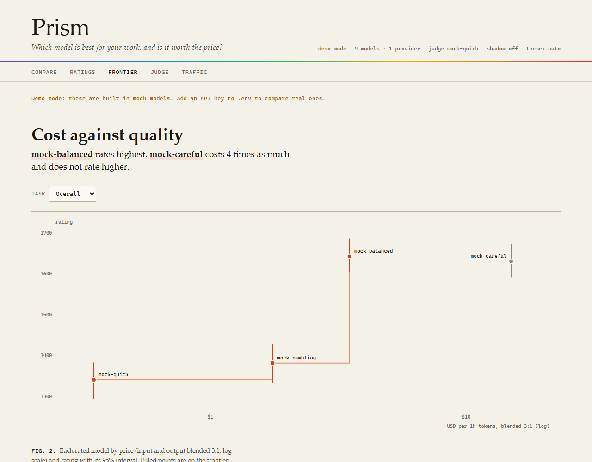

# Prism

Prism tells you which LLM is best for your own work, how sure it is, and whether the better model is worth what it costs. Then it routes your API traffic on that answer.

Public leaderboards rank models on other people's prompts. Prism ranks them on yours. You compare models blind on prompts from your real work, or let Prism quietly compare them on a sample of your live traffic, and it fits a rating for each model with a confidence interval. The router uses those ratings, including the uncertainty: it will not call a model "best" on the strength of three lucky wins.



## Try it without any API keys

```bash
git clone https://github.com/Evilander/prism.git
cd prism
npm install
npm run demo
```

Open http://localhost:3080. Demo mode uses four built-in mock models of differing quality, speed and price, seeds a few hundred comparisons between them, and lets you run blind comparisons, vote, and watch the ratings and the cost/quality chart respond. Nothing leaves your machine.

To use real models, copy `.env.example` to `.env`, add a key for at least one provider, and run `npm start`.

## How it works

**1. Comparisons.** Every piece of evidence is one pairwise outcome: model A beat model B, or they tied, on some prompt. Comparisons come from three places:

- You, voting blind in the dashboard. Responses are unlabelled and shuffled, and cost and token counts are hidden until you vote, because price alone gives most models away.
- An LLM judge, which rules on every comparison in the background.
- Shadow evaluation, which replays a fraction of your real proxy traffic to a second model and hands both responses to the judge. It is off by default and has a hard daily spend cap.

**2. Ratings.** Prism fits a [Bradley-Terry model](https://en.wikipedia.org/wiki/Bradley%E2%80%93Terry_model) to the whole comparison log at once, the same family of model LMArena uses, and runs a parametric bootstrap (replay every recorded game 200 times with the fitted win probabilities, refit each time) to get a 95% interval per model. Replaying, not resampling, matters at this scale: a model that has won all five of its games would otherwise get an interval of zero width. Ratings are never stored. They are recomputed from the log, so they do not depend on the order battles happened in, and a fix to the method re-rates all your history. Ties count as half a win each. Ratings are kept per task type (code, analysis, creative, general) and pooled.

The earlier version of Prism used online Elo. On a personal dataset that is the wrong tool: the result depends on battle order, and it gives no hint of how little twenty votes actually tell you.

**3. Routing.** Point any OpenAI-compatible client at Prism and pick a strategy:

| Strategy | Picks |
|---|---|
| `best` | The highest-rated model for the detected task type, among models with at least 5 games. |
| `value` | The cheapest model that Prism cannot say is worse than the leader. |
| `cheapest` | The lowest blended price. Models with an unknown price are skipped. |
| `fastest` | The lowest average latency over successful calls in the last 24 hours. |
| `round-robin` | Each model in turn. |

`value` is the one to understand. For every rated model it asks: in what share of the bootstrap refits does this model rate below the leader? If that share is under 90%, the data has not shown the model to be worse, so it stays in contention, and the cheapest contender wins. With no data, everything is in contention and you get the cheapest model. As your comparisons show that a pricier model really is better on your prompts, `value` moves up to it, and only then.

That default is deliberately slow to spend your money, and it has a cost: a model that is 75% likely to be worse than the leader still counts as "not shown worse" and can be picked. If you would rather move to the better model as soon as it is more likely than not, set `PRISM_VALUE_CONFIDENCE=0.5`. Models with fewer than 5 games are never considered, however cheap; compare them first, or let shadow evaluation do it.

Naming a model in the request bypasses all of this and routes to that model. If it fails, the request fails with the provider's own status code (a 404 for a retired model, a 429 for a rate limit); Prism does not answer with a different model. The provider's error text goes to the server log, not into the response.



## How much data do you need?

More than you would guess. This table comes from simulating games between four models whose true ratings are 1600, 1550, 1500 and 1400, forty trials per row (`node scripts/interval-width.js`):

| Comparisons | Median 95% interval | True best model ranked first |
|---:|---:|---:|
| 20 | ±197 | 50% |
| 50 | ±116 | 75% |
| 100 | ±77 | 73% |
| 200 | ±55 | 93% |
| 500 | ±35 | 95% |
| 1000 | ±24 | 100% |

Twenty votes is a coin flip between closely matched models. That is why the intervals are on screen everywhere, why models with fewer than 5 games are never routed on, and why shadow evaluation exists: it gets you to a few hundred comparisons without a few hundred evenings of voting.

## Checking the judge

An LLM judge has known biases: it favours whichever response it reads first, it favours longer responses, and it favours its own family's writing ([Zheng et al., 2023](https://arxiv.org/abs/2306.05685)). Prism does what is cheap to do about each, and then measures what is left:

- Every pair is judged twice with the positions swapped. If the two verdicts disagree, the pair is recorded as a tie, not as a win for anyone.
- The judge is chosen from a provider that has no model in the comparison. If that provider is not answering (an expired key, an account out of credit), the next candidate rules instead, and a judge that does share a provider with a contestant is labelled as such.
- The judge is told not to reward length, and the dashboard shows how often it picked the longer response anyway.
- When you vote on a comparison the judge also ruled on, your verdict replaces the judge's in the ratings, and the pair is counted toward the judge's agreement rate with you (raw agreement and Cohen's kappa). If that number is poor, switch the leaderboard to "my votes only".

## Using the proxy

```python
from openai import OpenAI

client = OpenAI(base_url="http://localhost:3080/v1", api_key="unused")  # or your PRISM_SECRET

# Let Prism choose. extra_body carries the strategy.
response = client.chat.completions.create(
    model="auto",
    messages=[{"role": "user", "content": "Write a Python merge sort"}],
    extra_body={"strategy": "value"},
)
print(response.model)                      # the model that answered
print(response.model_extra["prism"])       # why it was chosen, cost, latency, failover
```

Streaming works. `temperature`, `top_p`, `stop`, `seed`, the penalties, `response_format`, `tools` and `tool_choice` are forwarded; anything Prism ignored is listed in `prism.ignored_params` instead of vanishing. When Prism chose the model and the provider fails, it tries up to two more, moving to a different provider before it tries the same one again. Providers with three consecutive failures go to the back of the queue.

## Command line

```bash
npx prism demo                                   # seeded demo on mock models
npx prism eval prompts.txt --models a,b,c        # run every prompt against every model, judge, print ratings
npx prism leaderboard --task code                # current ratings from the database
npx prism route "refactor this function" --strategy value   # which model would be picked, and why (no request sent)
npx prism export > comparisons.jsonl             # your comparison log, one JSON object per line
```

`prompts.txt` is one prompt per line; a `.jsonl` file of `{"prompt": "..."}` objects also works.

## Providers

OpenAI, Anthropic, Google Gemini, xAI, Mistral, Groq and OpenRouter by API key, and local models through Ollama. Model lists are read from each provider's own API at startup, so any model your key can reach can be named in a request or entered in a comparison. The router is pickier: left to itself it chooses only among a short curated list per provider (flagship, mid, small) plus any model you have compared, because a live catalog also lists every legacy snapshot a provider still serves. `PRISM_POOL` overrides that.

Prices come from OpenRouter's public model catalog. A model whose price cannot be matched is shown as "unknown" and is left out of `cheapest` and `value`; it is never treated as free.

## Configuration

Everything is in `.env.example` with comments. The settings that matter most:

| Variable | Default | |
|---|---|---|
| `DEFAULT_STRATEGY` | `best` | Used when a request names neither a model nor a strategy. |
| `PRISM_POOL` | curated models plus compared ones | Comma-separated model ids the router may choose between. |
| `SHADOW_RATE` | `0` | Fraction of proxy requests to replay to a challenger model. |
| `SHADOW_DAILY_BUDGET_USD` | `1.00` | Shadow evaluation stops for the day when challenger plus judge spend reaches this. |
| `PRISM_SECRET` | unset | When set, every API call needs `Authorization: Bearer <secret>`. |
| `HOST` | `localhost` | Set `PRISM_SECRET` before changing this. |

## What Prism is not

Prism is not a production gateway. If you need virtual keys, team budgets, caching, guardrails, or a hundred provider integrations, use [LiteLLM](https://github.com/BerriAI/litellm). LiteLLM also has shadow evaluations: it samples a key's traffic, replays it through its auto-router, and reports a win rate to help you decide whether to switch. Prism's version feeds a rating model that the router acts on continuously, with intervals. If you only want the gateway, LiteLLM is the better tool.

It is also single-user: one SQLite file, one set of preferences, no accounts.

Other limits worth knowing before you rely on it:

- Tool calling only works on OpenAI-compatible providers (OpenAI, xAI, Mistral, Groq, OpenRouter, Ollama). A request with `tools` is routed only to those. Naming an Anthropic or Gemini model with `tools` returns a 400 rather than silently answering as plain chat.
- Shadow evaluation copies prompts. A sampled request is sent to a second provider and to the judge's provider, and both responses are stored in the local database. Requests with tools or images, and any request sent with an `x-prism-no-shadow` header, are never sampled. Leave it off for traffic you would not send to a second vendor.
- Task detection is a keyword heuristic. It decides which rating table a request reads from, and it is wrong sometimes. Pass `taskType` in arena requests when you know better.
- The judge is a model and makes mistakes. The Judge tab exists so you can see how often.
- Only differences between ratings mean anything. The scale is pinned so that an average model sits near 1500; the level itself carries no information.
- A rating gap predicts an expected score in which a tie counts as half a win. If many of your comparisons end in ties (the judge records a tie whenever its two verdicts disagree), gaps come out smaller than they would from decisive results alone. The order of the models is not affected.
- Ratings are keyed by model id. The same id served by two providers is treated as one model.

## Security

Prism holds your provider API keys, so it is careful about who can reach it. It listens on `localhost` by default, rejects requests whose `Host` header is not a loopback name (which blocks DNS rebinding), sends no CORS headers unless you set `CORS_ORIGIN`, and serves the dashboard under a strict Content-Security-Policy with no third-party assets. The Docker Compose file publishes the port on `127.0.0.1` only. If you expose Prism to a network, set `PRISM_SECRET`.

## API

| Endpoint | |
|---|---|
| `POST /v1/chat/completions` | OpenAI-compatible chat, streaming or not |
| `GET /v1/models` | Every model that can be named; `routable` marks the ones the router picks from |
| `POST /arena/battle` | Run a blind comparison; responses come back unlabelled |
| `POST /arena/session`, `GET /arena/stream/:session/:combatant`, `POST /arena/session/:id/finalize` | The same, streamed |
| `POST /arena/vote` | `{battleId, winnerPosition}` or `{battleId, tie: true}` |
| `GET /arena/reveal/:id` | Model identities, after you vote (`?forfeit=1` to give up the vote) |
| `GET /arena/battles` | Recent comparisons; models stay hidden while one is awaiting your vote |
| `GET /arena/leaderboard` | Ratings with intervals; `?taskType=` and `?source=human\|judge\|all` |
| `GET /arena/judge` | Which judge is in use and how well it agrees with you |
| `GET /api/frontier` | Price and rating per model, with frontier membership |
| `GET /api/shadow` | Shadow evaluation status and today's spend |
| `GET /api/stats`, `/api/requests`, `/api/providers` | Traffic, request log, provider health |
| `GET /health`, `GET /api/config` | Liveness, and what the dashboard needs to start. Both stay open when `PRISM_SECRET` is set. |

## Development

```bash
npm test
```

The tests need no network and no API keys; providers are exercised through the built-in mock. Node 20 or newer. Four runtime dependencies: express, better-sqlite3, helmet, dotenv. The dashboard is plain HTML, CSS and JavaScript with no build step.

## License

MIT
